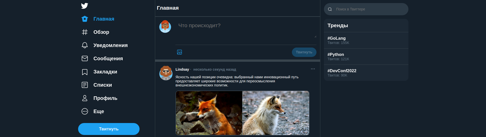

<h1 align="center">Twitter Corporate</h1>
<h2 align="center">

[](https://github.com/vuejs/awesome-vue)

</h2>

<p align="center">
  


</p>




## Description

Описание проекта

## Установка и запуск

инструкция к установке

## About the project.

## Project setup

```
npm install
npm run serve
```

## Support on Beerpay

Обратная связь
