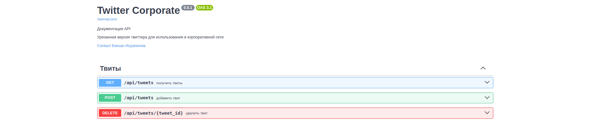
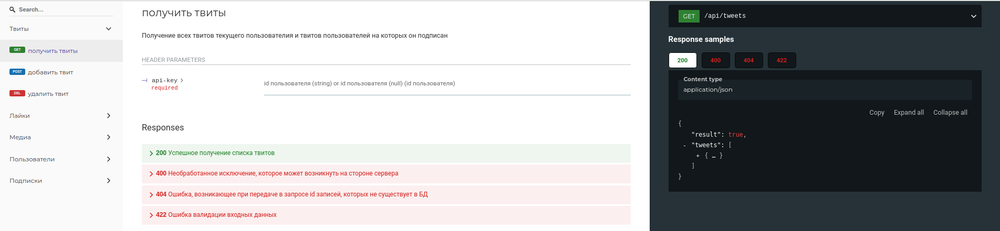

<h1 align="center">Twitter Corporate</h1>
  

<p align="center">


  


</p>

<p align="center">
</p>

## Описание сервиса

Twitter Corporate - урезанная версия твиттера, предназначенного для использования в корпоративной сети, в качестве серивиса микроблогов. Имеет следующие функциональные возможности:
1. Пользователь может добавить новый твит.
2. Пользователь может удалить свой твит.
3. Пользователь может подписаться на другого пользователя.
4. Пользователь может отписаться от другого пользователя.
5. Пользователь может отмечать твит как понравившийся.
6. Пользователь может убрать отметку «Нравится».
7. Пользователь может получить ленту из своих твитов и твитов от пользователей, на которых он подписан. Сортировка списка твитов ленты будет отображен отсортированным в
порядке убывания по популярности 
8. Твит может содержать картинку.

## Установка и запуск

Для запуска сервиса вам понадобится система с установленным Docker.
Если он уже установлен - скопируйте репозиторий и из директории с файлом docker-compose.yml ведите следующую команду в терминале:

```
docker compose up
```
*Примечание: перед запуском убедитесь, что в директории запуска имеется файл .env c определёнными переменными окружения*

Теперь откройте интернет-браузер и введите в строке URL сервиса: по умолчанию http://localhost/8000 

## Режим тестового запуска

Режим тестового запуска позволит вам увидеть работу сервиса, как она выглядела бы после некоторого времени использования в крупной корпоративной сети, т.е. с заполненными страницами с твитами и картинками. Включить этот режим можно с передачей переменного окружения __TEST_MODE__ со значением __true__.  После запуска сервиса, таблицы базы данных будут заполненны с множеством случайных записей.
<p align="center">
</p>

## Настройки запуска

При желании можно запустить сервис с предпочтительными для вас настройками. Они находятся в файле .env корневой директории сервиса. Список включает следующие настройки:

* __POSTGRES_USER=admin__ - логин пользователя в СУБД Postgres
* __POSTGRES_PASSWORD=admin__ - пароль пользователя в СУБД Postgres
* __POSTGRES_DB=twitter_db__ - название базы данных в СУБД Postgres
 
* __POSTGRES_PORT=5432__ - порт, который будет слушать запросы в СУБД Postgres
* __FASTAPI_PORT=8000__ - порт сервиса, который будет слушать http-запросы клиента

* __TEST_MODE=false__ - если установить значение __true__, то сервис после запуска заполнит базу данных случайными записями. Это полезная функция, использование которой представит вам работу сервиса с заполненными страницами с различными твитами с различными картинками.

Для безопасности можно удалить этот файл .env и передать эти переменные в команде запуска __docker compose run__ в параметре __--env__.
Пример:
```
docker compose run --env POSTGRES_USER=admin <service name>
```

## Документация API

Всю документация OpenAPI маршрутов приложения вы можете получить по ссылке http://localhost/8000/docs
<p align="center">
</p>

или по ссылке http://localhost/8000/redoc с другим стилем визуализации
<p align="center">
</p>

## Тестирование

Для тестирования функций приложения, необходимо сначала установить все зависимости из файла _.twitter_clone/tests/requirements_for_tests.txt__ командой:
```
pip install -r <requiremets file>
```
Далее из директории twitter_clone c файлом конфигурации pytest.ini необходимо запустить команду:
```
pytest -v
```

## Обратная связь

По всем вопросам пишите мне на почту: <a href="mailto:israpal@bk.ru" rel="noopener noreferrer" class="link">Бекхан Исрапилов</a>
